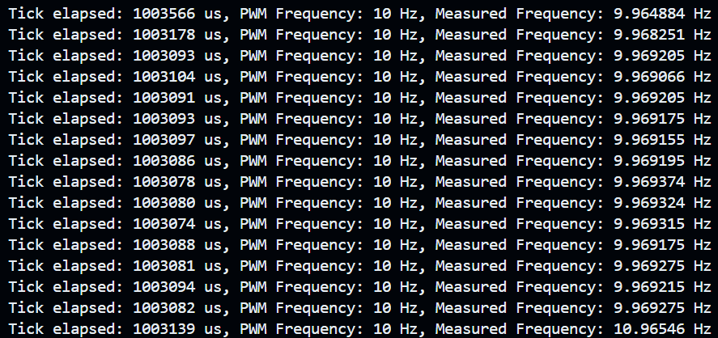
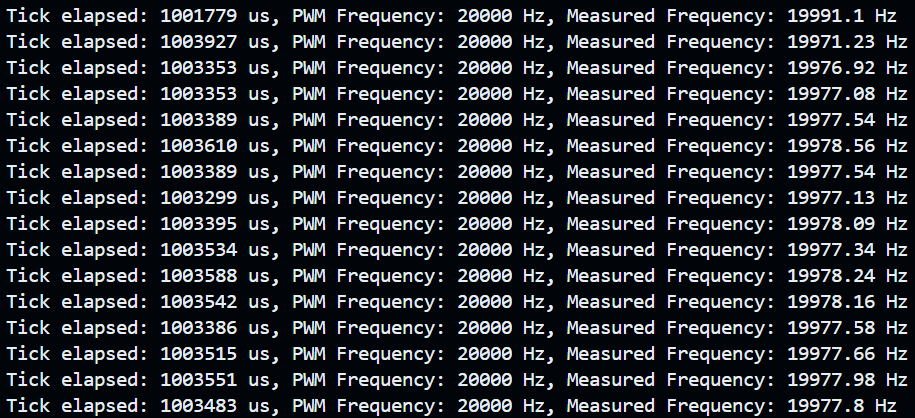
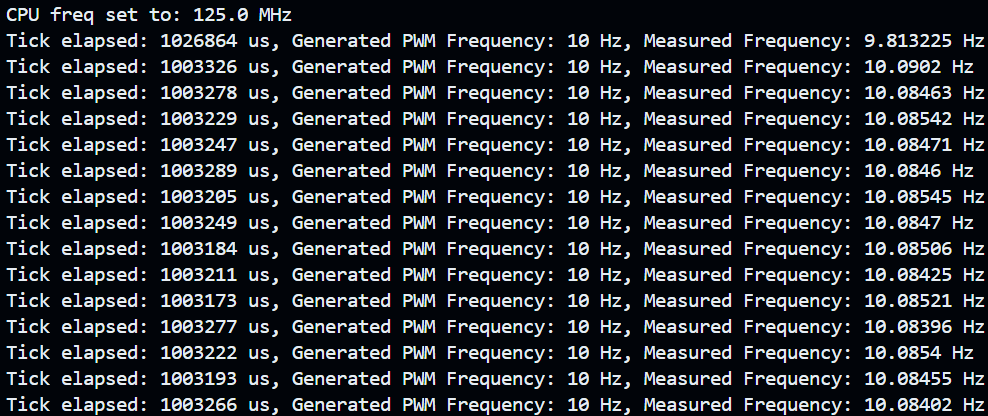
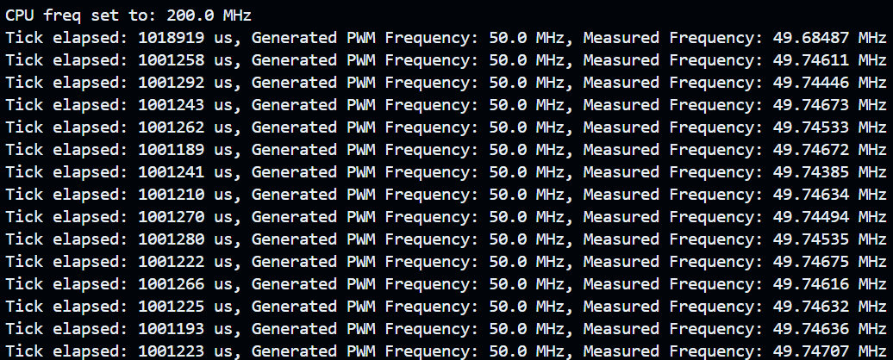
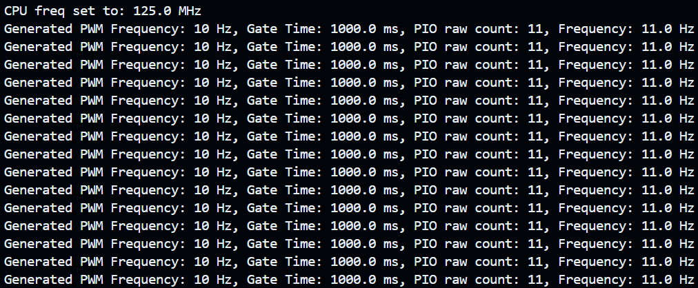
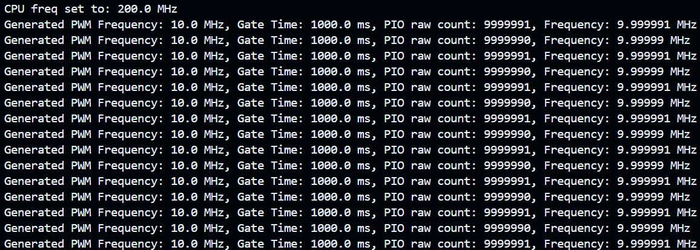
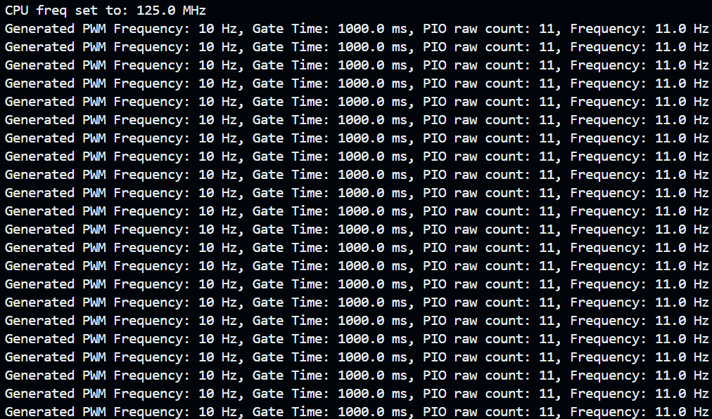
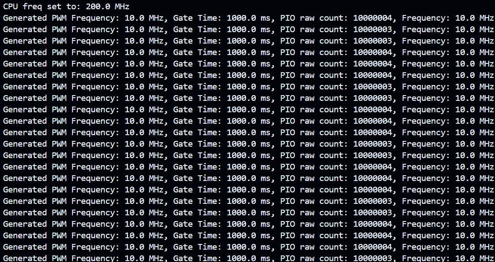

<!-- @format -->

# Pi Pico PIO Frequency Measurement

A MicroPython program designed to measure the frequency of a PWM signal using the Raspberry Pi Pico's PIO (Programmable Input/Output). The program is capable of counting the number of input pulses within a specified gate time, thereby calculating the frequency of the input signal with high accuracy.

## Recent Changes

- <font color="yellow">**(CHANGE)** Rewrite PulseCounter class to improve the code readability and maintainability, and to allow the pulse counter to be used in other projects.
- **(CHANGE)** The new `pio_freq_ctr.py` now directly compare the previous pin state with the current pin state. This allow us to no longer rely on wait, which could stall the pio if the final state of the input pulse are fixed at high (then the pio will forever wait for low and won't push out the last recorded count, and this count might not get reset to 0 with the next count and mess up the output). This primarily allow the pio program to constantly report its pulse count to the FIFO. The downside is the need for a third register to store the previous pin state, and bit shifting to get the pin state we want and this result in a more complex pio program.
- **(NOTE)** I just realized the new version has a much lower maximum frequency range than the old one since the check status code block now take way more instruction cycle than the old version. Lesson here is to not push for a third register, the pio just not powerful enough for this kind of comparison.
- **(NOTE)** With an oscilloscope, I verified that the new version `pio_freq_ctr.py` can measure frequencies up to **5** MHz at 125 MHz CPU frequency, while the old version `pio_freq_ctr(wait).py` can measure frequencies up to **25** MHz at 125 MHz CPU frequency (probably even higher, as this was the highest frequency I can get out of a Raspberry pi 4B hardware pwm). This is due to the additional instruction needed for polling the pin state in the new version, so pick the version that suit your needs.
- **(CHANGE)** The `pio_freq_ctr_with_piopwm.py` source timing signal from a pio pwm program, which futher improve accuracy.</font>

## Table of Contents

- [Project Description](#project-description)
- [Key Features](#key-code-components)
- [Setup Instructions](#setup-instructions)
- [Usage](#usage)
- [Project Structure](#project-structure)
- [Contact](#contact)

## Project Description

The program utilizes the Pi Pico's PIO to create a high-precision frequency counter. It involves two PIO state machines:

1. **Pulse Counter**: Counts the number of falling edges of an input pulse during a defined gate time.
2. **Timing Pulse Generator**: Generates timing pulses for the pulse counter referred from a hardware PWM signal, which operates at a fixed frequency (8 Hz) to ensure accurate timing.

### Key Features

- **32-bit Counter**: Utilizes the Pi Pico’s 32-bit scratch register, enabling the program to handle a wide range of frequencies.
- **Accurate Timing**: A dedicated GPIO pin generates timing pulses, providing a reliable time interval for measurement. This is crucial as the `time.sleep()` and timer methods in MicroPython are not sufficiently accurate for precise timing, as demonstrated in `freq_ctr_interrupt.py` and `freq_ctr_pio_timer.py`.

  - The issues with using `time.sleep()` or Timer method include limited maximum frequency handling (approximately 20 kHz at 125Mhz CPU freq) and inaccurate timing due to frequent interrupts.

  - **Results with Different Methods**:
    - `freq_ctr_interrupt.py` using a interrupt handler to increment a counter on each pulse (up to 20 kHz):
      - 
      - 
    - `freq_ctr_pio_timer.py` a imple PIO machine to count pulses and callback function with Timer (up to 50Mhz at 200Mhz CPU freq but not accurate due to timer inaccuracies):
      - 
      - 
    - **This Method `pio_freq_ctr.py`**: Measures PWM frequencies from 10 Hz to 10 MHz (CPU overclock to 200Mhz) with high accuracy:
      - 
      - 
    - **This Method `pio_freq_ctr_with_piopwm.py`**: Measures PWM frequencies from 10 Hz to 10 MHz (CPU overclock to 200Mhz) with further higher accuracy by using a PIO PWM program to generate the timing pulse:
      - 
      - 

- **Hardware-Linked Timing**: The timing pulse is generated by the Pi Pico's hardware PWM, operating at the lowest possible frequency of the current CPU running frequency. This ensures that the timing is unaffected by CPU interrupts or other MicroPython-related delays.
- **Side-set Pin for Gate Control**: Another GPIO pin acts as the side-set pin, where the timing pulse state machine signals the pulse counter PIO to start and stop counting by toggling the side-set pin.
- **CPU Independence**: The PIO method allows pulse counting without CPU involvement, with the PIO pushing the result to the FIFO every 1 second.
- **Interrupt Alignment**: An interrupt to ensures the timing pulse is synchronized with the actual PWM signal. (pending implementation in `pio_freq_ctr_with_interrupt_piopwm.py` using a third PIO to generate the timing pulse)

## Setup Instructions

1. **Clone the Repository**:

   ```sh
   git clone https://github.com/your-username/pi-pico-frequency-measurement.git
   cd pi-pico-frequency-measurement
   ```

2. **Upload the Program**:

   - Copy the `pio_freq_ctr.py` file to your Raspberry Pi Pico using your preferred method (e.g., Thonny, rshell, ampy).

3. **Connect the Hardware**:
   - **PWM Output Pin** (`PWM_TESTING_PIN_ABSOLUTE`): For testing PWM signal generated from the pico.
   - **Input Pulse Pin** (`INPUT_PULSE_PIN_ABSOLUTE`): Connect this to the pwm signal being measured.
   - **Timing Pulse Pin** (`TIMING_PULSE_PIN_ABSOLUTE`): This pin generates timing pulses to control the gate time, leave it disconnected.
   - **Side-set Pin** (`SIDESET_PIN_ABSOLUTE`): Controls the timing for starting and stopping the pulse counting, leave it disconnected.

## Key Code Components

### 1. **Pulse Counting PIO Program**

- **`pulse_counter_pio`**: This PIO program counts the number of pulses on the input pin during the gate time controlled by the side-set pin. It waits for the side-set pin to be set before starting the count and then pushes the count to the FIFO once the gate time ends. The counter is a 32-bit register, providing a broad range of frequency measurement capabilities.

- <font color="yellow">**(CHANGE)** we now compared the previous pin state with the current pin state, this allow us to no longer rely on wait, which could stall the pio if the final state of the input pulse are fixed at high (then the pio will forever wait for low), this also allow the pio program to constantly output the pulse count to the FIFO.</font>

### 2. **Timing Pulse Generator PIO Program**

- **`timing_pulse_pio`**: This PIO program generates timing pulses to control the side-set pin, effectively managing the gate time for pulse counting. It reads an 8 Hz PWM pulse generated by the Pi Pico hardware and waits for 8 cycles before signaling the pulse counter PIO to stop counting. This creates an accurate 1-second time interval, unaffected by MicroPython’s timing inaccuracies.

### 3. **PulseCounter Class**

- This class initiates the state machines for pulse counting and timing pulse generation. It handles initialization, starting, stopping, and reading of pulse counts. The class also includes a callback function that uses interrupts to align the timing pulse with the actual PWM pulse.

- <font color="yellow">**(CHANGE)** Rewrite to improve the code readability and maintainability, and to allow the pulse counter to be used in other projects.</font>

## Usage

1. **Run the Program**:

   - Once the program is uploaded to the Pi Pico, run it using the MicroPython REPL or an IDE like Thonny.

2. **Monitor Output**:

   - The program will output the measured frequency of the PWM signal in Hz, kHz, or MHz depending on the signal's frequency. Because the timing is hardware-linked and independent of the CPU, the measurements are highly accurate.

## Project Structure

```Python
pi-pico-frequency-measurement/
├── old/                                  # Old versions of the code
├── pio_freq_ctr_with_interrupt.py        # PIO frequency counter with interrupt for timing pulse alignment
├── pio_freq_ctr.py                       # PIO frequency counter program without interrupt for timing pulse alignment
├── freq_ctr_interrupt.py                 # Frequency counter using interrupt handler for pulse counting
├── freq_ctr_pio_timer.py                 # Frequency counter using PIO and Timer for pulse counting
├── README.md
```

## Contact

For any issues, questions, or contributions, please open an issue or submit a pull request on GitHub.
